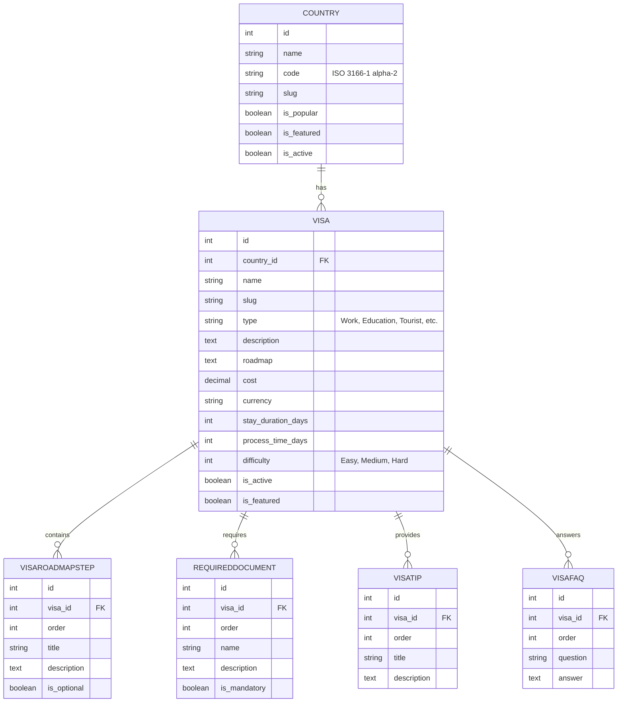

# Project Structure & Architecture

This document provides a high-level overview of the VisoWay backend architecture, focusing on the working services, available API endpoints, and database entity relationships.

## 1. Core Applications (Apps)

The Django project (`config`) is divided into two primary domain applications:

- **`countries`**: Manages geographic entities (countries) and their metadata (slugs, ISO codes, flags, popularity flags).
- **`visas`**: The core domain that manages visa policies, requirements, application roadmaps, tips, and FAQs. It also houses the AI generation services.

---

## 2. Database Relations

The database schema is strictly relational and centers around the `Country` and `Visa` models.

### Entity Breakdown
- **Country**: The root entity. Has a one-to-many relationship with Visas.
- **Visa**: Belongs to a single `Country`. Holds core metadata like type, difficulty, duration, and cost. 
- **Nested Entities**: `VisaRoadmapStep`, `RequiredDocument`, `VisaTip`, and `VisaFAQ` all belong to a specific `Visa` (Foreign Key) and include an `order` field to maintain proper sequential display on the frontend.

---

## 3. Working Services & APIs

### A. Countries API (`countries.views`)
Standard read-only REST endpoints for countries:
- **`GET /api/countries/`**
  - Lists countries.
  - **Filters**: `is_active` (defaults to True), `is_popular`, `is_featured`.
  - **Search**: By `name` or `code`.
  - **Ordering**: By `name`, `code`, `is_popular`, etc.
- **`GET /api/countries/{slug}/`**
  - Retrieves detailed information for a single country.
  - **Includes**: A prefetched list of active `visas` (basic summary data) associated with that country.

### B. Visas API (`visas.views`)
Comprehensive read-only REST endpoints for exploring visas:
- **`GET /api/visas/`**
  - Lists all active visas.
  - **Filters**: By `country` (ID or Code), `type`, `difficulty`, `cost_min`, `cost_max`.
  - **Search**: By `name`, `country__name`, `country__code`, `type`.
- **`GET /api/visas/{slug}/`**
  - Retrieves detailed visa information.
  - **Includes**: Prefetched nested relationships (`roadmap_steps`, `required_documents`, `tips`, `faqs`).
- **`GET /api/visas/country/{country_identifier}/`**
  - Dedicated endpoint to list all visas for a specific country using its slug, ISO2 code, or name.
- **`GET /api/visas/{country_identifier}/{slug}/`**
  - Dedicated endpoint to retrieve a single visa strictly by its parent country and visa slug, fully hydrating nested details.

### C. Internal / Background Services (`visas/services/`)
- **`ai_generator.py` (OpenRouter Integration)**
  - This is a backend service utilized primarily through the Django Admin Panel (`ai_admin.py`).
  - **Purpose**: It takes a bare `Visa` object (e.g., "Digital Nomad Visa for Spain") and sends a prompt to an external LLM via OpenRouter (defaulting to `nvidia/nemotron-3-super-120b-a12b:free`).
  - **Output**: It generates comprehensive, structured JSON content including a full description, step-by-step roadmap, required documents list, tips, and FAQs, which are then saved directly to the database.
  - **Usage**: Accessible to staff via a custom "Fill with AI" button on the Visa admin change form.
